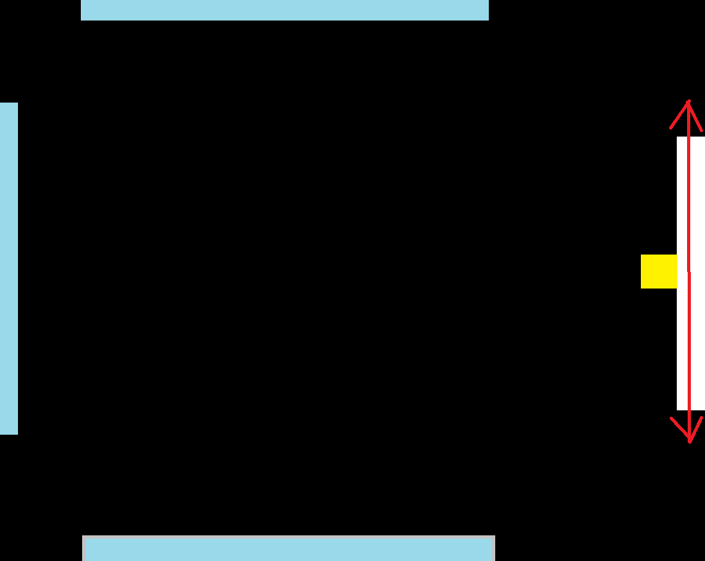
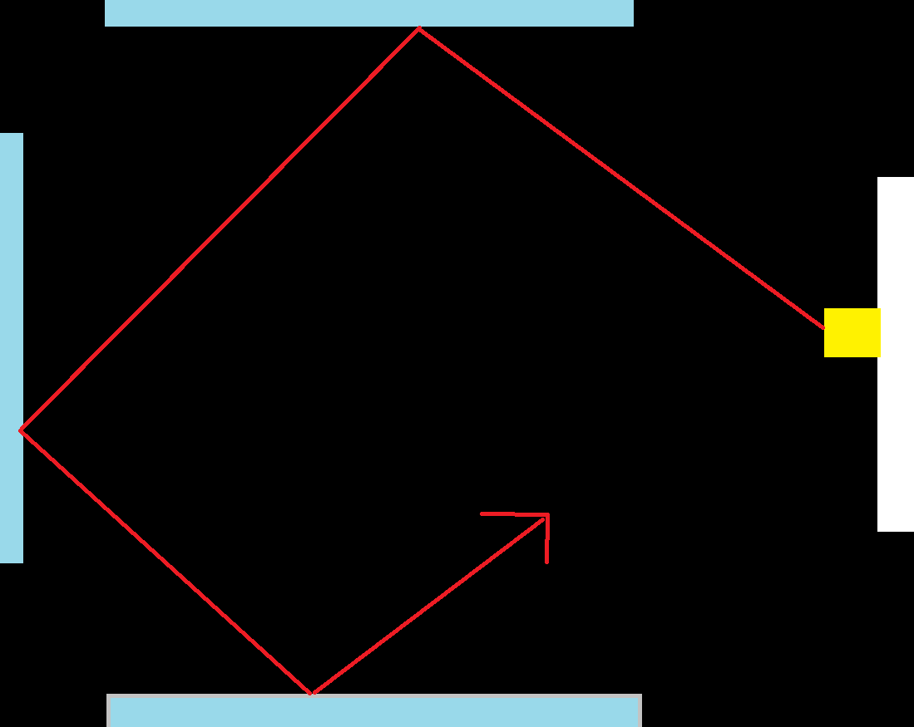
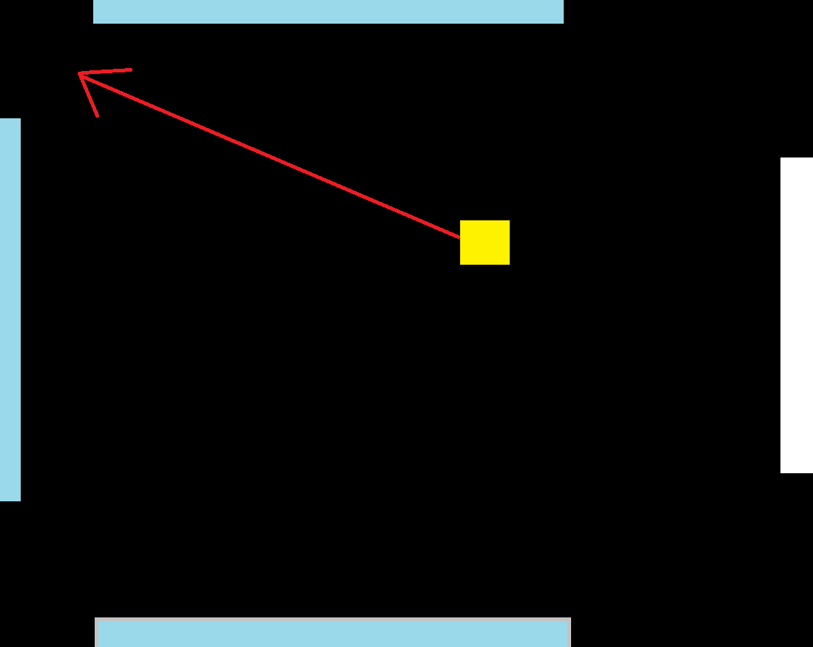

# Game0: RipCoil 2D
RipCoil 2D is a 2D adapataion of the VR game RipCoil for occulus rift.


"RipCoil 2D" is played on a single screen. The player controls the vertical position of a racket using their mouse, and uses it to bounce a ball multiple times without causing the ball to exit the screen.

## Gameplay
 
Every round, the ball starts in the middle of the screen, and the player has an option to move the raquet up or down and -- after the user clicks -- is launched to the right based on the position of the raquet.

 

If the ball hits the racket, it is bounced back into the field with a new velocity (depending on its position relative to the center of the racket). If the ball reaches the right wall, it is reset to the center of the field and launched when the user clicks. If the ball is lost three times, the game ends, and the level reached is displayed.



 

If the ball hits one of the pads, the number of bounces increases by 1 and the ball bounces off symmetrically. If the number of bounces is reached and the ball is caught, the game moves to the next level.

## Note: Ball Angle

The vertical velocity of the ball leaving the paddle is set by its position of impact relative to the center of the paddle. This allows the player to steer the ball.

## Note: Target Score

Every round, target bounces increase by one. The postion of the three pads are randomized.

### Disclaimer: I used some text from the default design document since some elements are really similar.

## Building

### Linux
```
  g++ -g -Wall -Werror -o main main.cpp Draw.cpp `sdl2-config --cflags --libs` -lGL
```
or:
```
  make
```

### OSX
```
  clang++ -g -Wall -Werror -o main main.cpp Draw.cpp `sdl2-config --cflags --libs`
```
or:
```
  make
```

### Windows

Before building, clone [kit-libs-win](https://github.com/ixchow/kit-libs-win) into the `kit-libs-win` subdirectory:
```
  git clone https://github.com/ixchow/kit-libs-win
```
Now you can:
```
  nmake -f Makefile.win
```
or:
```
  cl.exe /EHsc /W3 /WX /MD /Ikit-libs-win\out\include /Ikit-libs-win\out\include\SDL2 main.cpp Draw.cpp gl_shims.cpp /link /SUBSYSTEM:CONSOLE /LIBPATH:kit-libs-win\out\lib SDL2main.lib SDL2.lib OpenGL32.lib
  copy kit-libs-win\out\dist\SDL2.dll .
```

